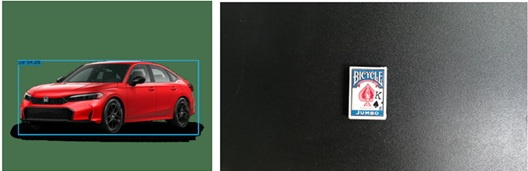

# **AI-535 Final Project**

Bryan Olmstead

3/1/2026

## **YOLOX with One-Shot field training capability**

Real-time one-shot object detector providing full 360° oriented bounding box for vision guided robotic applications using siamese **YOLOX** network.

## **INTRODUCTION**

Vision guided robotics with a wrist-mounted camera can be used for pick and place applications for stationary or moving objects. While some applications require full 6 degree of freedom location of objects, many applications require only 5 degrees of freedom (x,y,z,w,h,θ), with the assumption that the object is rotated only around the camera axis.

An efficient image processing algorithm uses 2D image processing to determine the identity and location of objects within a 2D image with 4 degrees of freedom (x,y,w,h,θ) and uses depth from stereo to determine the distance z from the camera to the object, enabling the 3D location and orientation of the object to be determined with 5 degrees of freedom.

The **LINE2D** template-matching algorithm by [Multimodal Templates for Real-Time Detection of Texture-less Objects in Heavily Cluttered Scenes](http://www.stefan-hinterstoisser.com/papers/hinterstoisser2011linemod.pdf) by Stefan Hinterstoisser is an effective technique for finding objects in a 2D image. This algorithm can be invariant with respect to translation, rotation, and scale. It is used by **Visual Robotics** in their *Template Finder*, **MVTec** in their *HALCON* software, and in a modifed fashion by **Cognex** in their *PatMax* algorithm. 

The LINE2D algorithm is a brute-force algorithm that creates scaled and rotated templates consisting of dominant oriented edges. While it generally performs well, it can be brittle in real-world environments due to noise, illumination variations, and warping due to non-rigid objects. The algorithm is compute intensive, and is only moderately parallelizable. One of the beneficial features of the LINE2D is that templates can be created in the field, enabling a vision system to rapidly adapt to new objects.

It is desirable to develop an improved object detector that is more rugged in real-world environments - less sensitive to noise and illumination variations, and able to tolerate object deformation. It is desirable for the algorithm to be innately parallelizable so that it can run efficiently on edge-computing hardware such as a GPU. A neural network may provide that result.

## **YOLO and its limitations**

**YOLO** (You Only Look Once) is a family of CNNs designed for efficient object classification, detection, and segmentation. [YOLOv1](https://arxiv.org/abs/1506.02640) was developed by Joseph Redmon in 2016. Since then, many versions have been developed, primarily by [Ultralytics](https://docs.ultralytics.com/). YOLO provides high speed detection on **edge AI** hardware, which is beneficial for robotic pick and place applications. Most YOLO versions provide a so-called **axis-aligned bounding box (AABB)**. For robotic pick and place applications, a so-called **oriented bounding box (OBB)** is required. OBB versions of YOLO provide orientation within ±90° (180°) limits. For robotic pick and place applications, a full ±180° (360°) is required. YOLO, like most deep learning networks, requires objects to be pre-trained. This is incompatible with the desire to have a field trainable object detector. Commercial use **Ultralytics** versions of YOLO is problematic due to their use of AGPL-3.0 license, which requires open-sourcing of all source code for any project that uses it. It is desirable to develop a version of YOLO that uses a more permissive commercial friendly license, detects the orientation of objects with full 360° orientation, and supports field training of new objects.

## **YOLOX**

**YOLOX**, developed in 2021 [YOLOX GitHub Repo](https://github.com/Megvii-BaseDetection/YOLOX), was developed to be anchor-free (less restrictions on object location), high accuracy (as measured by mAP), more flexible and modular (with decoupled classification and regression heads), and uses a commercial friendly Apache-2.0 license. This forms the basis of the object detector developed in this project.

**YOLOX Paper (2021):** Zheng Ge, Songtao Liu, Feng Wang, Zeming Li, and Jian Sun. *YOLOX: Exceeding YOLO Series in 2021*. arXiv preprint arXiv:2107.08430. [PDF](https://arxiv.org/abs/2107.08430)

**One-Shot Detection**

In the deep learning community, **One-Shot Detection** is the term used to describe a network that detects new objects without being trained. One popular network architecture for implementing one-shot detection is **Siamese Networks** popularized by the paper [Siamese Neural Networks for One-shot Image Recognition](https://www.cs.cmu.edu/~rsalakhu/papers/oneshot1.pdf). Siamese Network techniques will be used to implement the detector for this project.

## **Project Requirements**

<table border="1">
  <tr style="background-color: lightgray;">
    <th>Parameter</th>
    <th>Value</th>
  </tr>
  <tr>
    <td>Target Hardware</td>
    <td>Movidius Myriad X (1TOPS)<br>Qualcomm QCS8550 (48TOPS)</td>
  </tr>
  <tr>
    <td>Orientation</td>
    <td>±180° (360°)</td>
  </tr>
  <tr>
    <td>Field Training</td>
    <td>100 templates</td>
  </tr>
</table>

## **Project Phases**

The project is developed in 7 phases.

<table border="1">
  <tr style="background-color: lightgray;">
    <th>Phase</th>
    <th>Description</th>
    <th style="width: 300px; word-wrap: break-word;">Details</th>
  </tr>
  <tr>
    <td>1</td>
    <td>Data set creation</td>
    <td>Create annotated dataset for novel objects</td>
  </tr>
  <tr>
    <td>2</td>
    <td>YOLOX AABB</td>
    <td>Train YOLOX AABB on novel objects as baseline</td>
  </tr>
  <tr>
    <td>3</td>
    <td>OBB 360° head</td>
    <td>Add (cosθ, sinθ) head to provide 360° OBB and train with novel objects</td>
  </tr>
  <tr>
    <td>4</td>
    <td>Cosine similarity head</td>
    <td>Add normalized dot product to compute cos(θ) similarity of template vector with feature map output</td>
  </tr>
  <tr>
    <td>5</td>
    <td>Location, orientation, NMS</td>
    <td>Process feature map to determine location and orientation while eliminating duplicate matches with NMS</td>
  </tr>
  <tr>
    <td>6</td>
    <td>Siamese network</td>
    <td>Improve performance by creating metric feature space with Siamese network</td>
  </tr>
  <tr>
    <td>7</td>
    <td>Deployment on edge hardware</td>
    <td>Deploy on MyriadX and QCS8550</td>
  </tr>
</table>

## **Phase 1 - Data Set**

<span style="color:red;">
Data set – 3 rotated and translated objects. Custom 360° OBB annotation tool. Novel objects: 3 new objects, rotated and translated. All images annotated with tool. Create AA bounding boxes for use with standard YOLOX. Letterboxing from 640x360 to 640x640. Augmentation – rotate, translate, lighting, noise. Divide into training and test set. 
</span>

## **Phase 2 - YOLOX AABB**

<span style="color:red;">
Prove that I can train the network for custom classes.
</span>

## **Phase 3 - OBB 360° head**

<span style="color:red;">
OBB head: (cos θ, sin θ) unit vector.
Loss function: dot product, how to normalize so vector tries to be unit vector.
Combined loss function.
Train existing classifier head on 3 objects. 
Train existing x,y,w,h head on 3 objects.
Configuration of network – YOLOX + OBB head.
Training hyperparameters.
Graph of training loss, test loss vs epochs.
Loss = 1 - normalized dot product = 1 – cos dθ ~ dθ
</span>


## **Phase 4 - Cosine similarity head**

<span style="color:red;">
Cosine similarity aka dot product aka 1x1 convolution.
Look at literature for other ideas.
No training needed.
Create rotated and scaled templates.
Plot heat maps vs translation, scale, rotation
How many templates are needed for good performance?
Test on novel objects.
</span>

## **Phase 5 - Location, orientation, NMS**

<span style="color:red;">
Process the similarity output to provide true object location
</span>

## **Phase 6 - Siamese network**

<span style="color:red;">
Look at literature about how to do it.
Create contrastive loss, which I think would be better than triplet loss.
Add network to end of FPN basically a metric head.
Train this network with all my data.
Test it on novel objects.
Compare performance with phase 3. 
</span>

## **Phase 7 - Deployment on edge hardware**

<span style="color:red;">
Figure out how to deploy on Movidius Myriad X.
Measure speed and performance.
Figure out how to deploy on OAK4-D.
Measure speed and performance.
</span>

## **Comments from Fuxin Li**

<span style="color:red;">
Expects 60%-70% performance compared to fully trained NN
Vision Language Model (VLM) might work better
Few-Shot is called Multi-Template Matching
See NVIDIA blog: Detecting Rotated Objects Using the NVIDIA Object Detection Toolkit _ NVIDIA Technical Blog
Look at https://github.com/NVIDIA/retinanet-examples/tree/main
</span>

## **Journal**

**2/9/26** – 2hrs

Set up YOLOX on laptop. Working in VS Code.
Created miniconda environments: 
```
opencv-env
yolox
```
Got repo from https://github.com/Megvii-BaseDetection/YOLOX

Detections: car in class, cards not in class…


```
python tools/demo.py image -n yolox-s -c yolox_s.pth --path car.png --conf 0.25 --nms 0.45 --tsize 640 --save_result --device cpu
```
```
python tools/demo.py image -n yolox-s -c yolox_s.pth --path 'C:\Users\Bryan\OneDrive - Visual Robotic Systems, Inc\Visual Robotics\OSU\AI535\project\AI535-Images\cards.450.03.png' --conf 0.25 --nms 0.45 --tsize 640 --save_result --device cpu
```
   
**2/10/26** – 1hr

Created captures of M&Ms, Cards, Cheetos. About 40 images, different translation, rotation, scale. Used RPC image capture program with VIM-303.

**2/11/26** – 2hrs

Created annotation tool in Python. Annotated OBB with (cx,cy,w,h,θ).

**2/13/26**

Created GitHub repo: https://github.com/bryanolmstead-vr/YOLOX-fork 

**2/16/26** – 1hr

Gave presentation in AI535 class. Fuxin’s comment was to use Siamese networks.

**2/19/26** – 3hrs

Created the framework of original Word document.

Created AI535 project GitHub repo: https://github.com/bryanolmstead-vr/YOLOX-OneShot 

Created branch protection rule on main. Annotated 2nd set of images. Decided that letterboxing (just center the 640x360 image inside 640x640 with black otherwise) is the best plan. Need to scale annotation as well (height and Y coordinate). Letterboxed YOLOX-Std dataset with AA bounding box.

**2/20/26** – 1hr

Created data set AI535-Images3 which has a white background. Has images of 3 objects at a time: candy, cards, cheetos. Has images of new objects: vention plates, APMC 402-403 parts, cereal, rice, noodle roni, milk duds, individual playing cards, pretzels, doritos, lays.

**2/25/26** – 2hrs

Need to have multiple annotations for images that have multiple objects. 
Combined the annotations – one per line in the text file – for the multi-object images. Updated the show_annotation_aa.py script to show multiple objects and display filename. Installed albumentations (for augmentation).

```
conda activate yolox
conda install -c conda-forge albumentations
python
import albumentations as A
print(A.__version__)
2.08
```

Apparently the YOLOX training script already does augmentation.
The label files need to be turned into a COCO style file:

```
YOLO:	class_id x_center y_center width height   (normalized 0–1)
COCO:	x_min = (x_center - width/2) * image_width
y_min = (y_center - height/2) * image_height
box_width  = width * image_width
box_height = height * image_height
```

Created `yolo2coco.py` to perform the conversion
After conversion the data set should look like:

```
datasets/mydataset/
 ├── train2017/
 ├── val2017/
 └── annotations/
      ├── instances_train2017.json
      └── instances_val2017.json
```

Next steps. In YOLOX:

```
exps/example/yolox_s.py
rename to
yolox_mydata.py
edit
self.num_classes = 3
self.data_dir = "datasets/mydataset"
self.train_ann = "instances_train2017.json"
self.val_ann = "instances_val2017.json"
```
 
To train:

```
python tools/train.py \
    -f exps/example/yolox_mydata.py \
    -d 1 \
    -b 8 \
    --fp16 \
    -o \
    -c yolox_s.pth
```

Recommendations based on 145 images in dataset:

```
Batch = 4 to 8
Epochs = 100 to 150
Augmentation = built-in mosaic + mixup + randomaffine + hsv + flip
	Actually I don’t want flip since it destroys the 360
Use pretrained weights yolox_s.pth from COCO
```

```
python tools/train.py \
    -f exps/example/yolox_mydata.py \
    -d 1 \
    -b 4 \
    --fp16 \
    -o \
    -c yolox_s.pth \
    -e 150
```

Split images into 80% train 20% eval

Turn off flip:

```
yolox/data/data_augment.py
self.transform = TrainTransform(
    max_labels=50,
    flip_prob=0.0,  # DISABLE flipping
    hsv_prob=1.0
)
```

Edit yolox_mydata.py:

```
self.data_num_workers = 4
self.input_size = (640, 640)
self.random_size = (14, 26)
```

to do inference:

```
YOLOX_outputs/
 └── mydata/
      └── best_ckpt.pth   # usually the best validation model

python tools/demo.py image \
    -f exps/example/yolox_mydata.py \
    -c YOLOX_outputs/mydata/best_ckpt.pth \
    --path datasets/mydataset/val2017/img10.jpg \
    --conf 0.25 \
    --nms 0.45 \
    --tsize 640 \
    --save_result
```

do an entire folder:

```
python tools/demo.py image \
    -f exps/example/yolox_mydata.py \
    -c YOLOX_outputs/mydata/best_ckpt.pth \
    --path datasets/mydataset/val2017 \
    --conf 0.25 \
    --nms 0.45 \
    --tsize 640 \
    --save_result
```

**3/1/2026** - 2hrs

Converted Word document into this README file that will get printed as a PDF file.

**3/2/2026** - 30min, 9:30

Splitting up data set between train and validation sets. converting annotation to COCO format for training.

There are 145 files: split 80% training, 20% validation.
I chose 29 files for validation.

Label files were converted to COCO format using `yolo2coco.py`
Created directory structure
```
datasets/COCO
 ├── train2017/ candy.200.01_640x640.png
 ├── val2017/   candy.300.02_640x640.png
 └── annotations/
      ├── instances_train2017.json
      ├── instances_val2017.json
      ├── train2017/ candy.200.01_640x640.txt
      └── val2017/   candy.300.02_640x640.txt
```